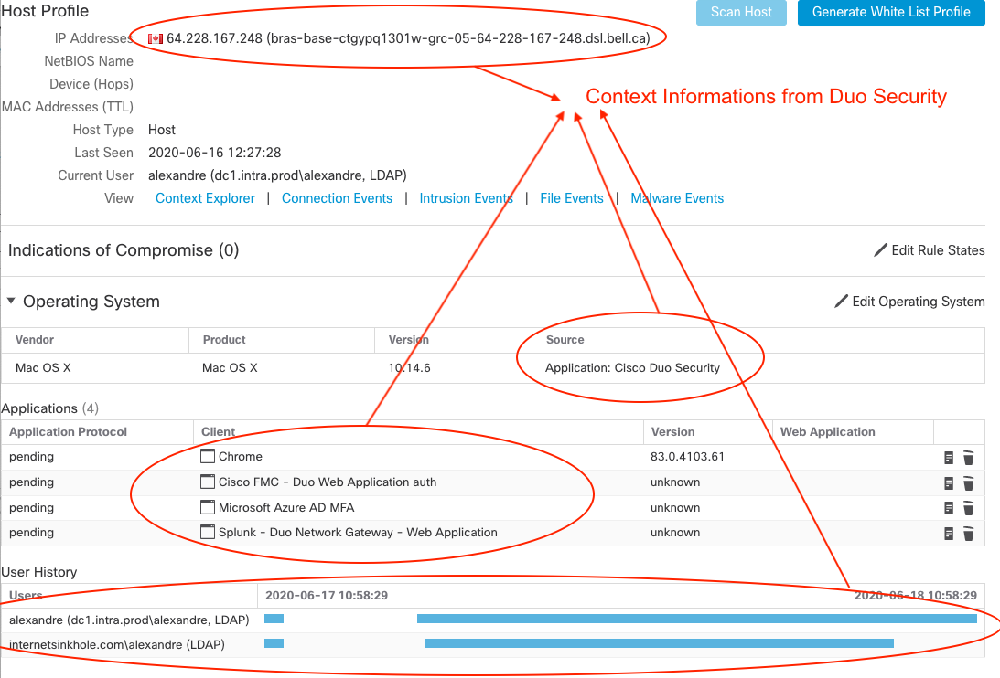
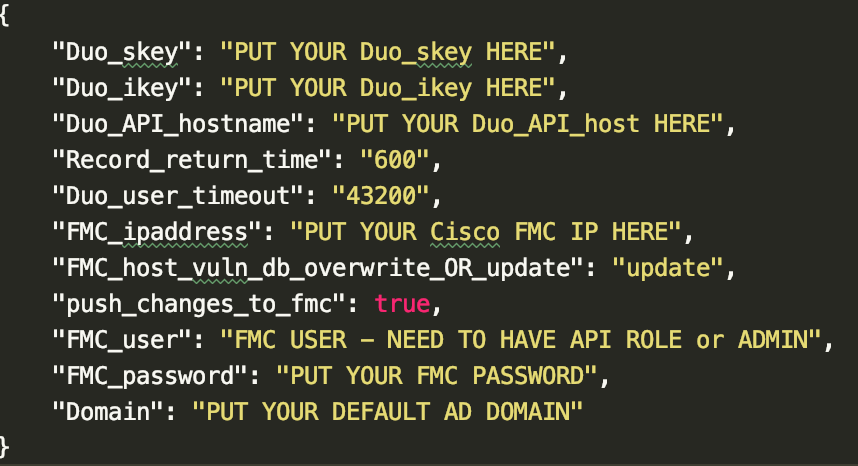
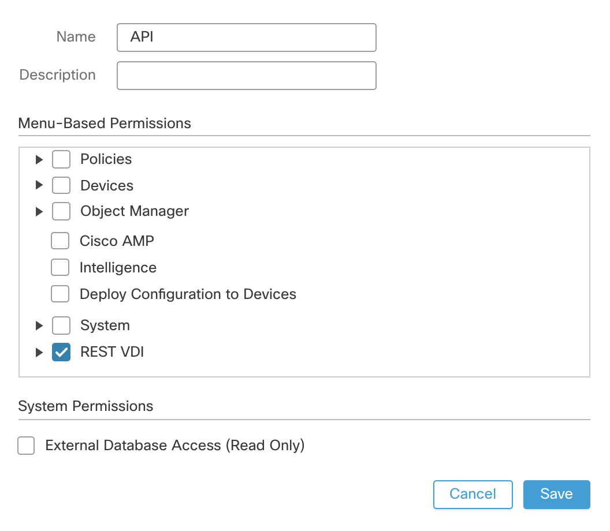
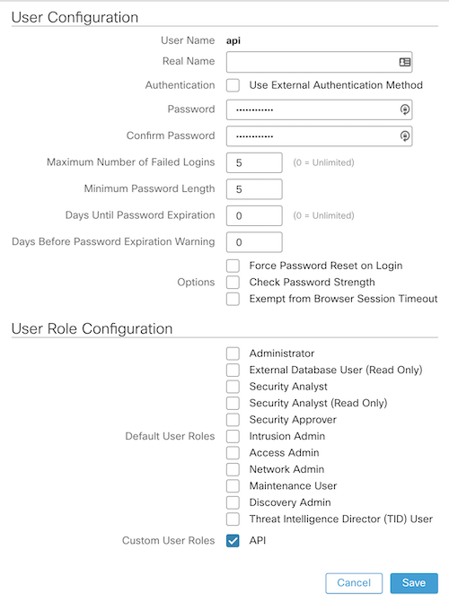

### Sharing Duo User Context (IP & HostProfile) to FMC
  
This repo contains a Python script to grab User context information, IP & Host profile, from a Duo Security authentification and share this with Cisco FMC.

  
Please contact me at alexandre@argeris.net, if you have any questions or remarks. If you find any bugs, please report them to me, and I will correct them. 
  
### VARIABLES TO MODIFY BEFORE RUNNING THE SCRIPT 
parameters.json need to be modify before running the script.

### How to create a FMC user with API role
Add a new role.

Add a new user

### This script is based on the AMP4e-to-FMC-Host-Input-Script available on cisco.com
### Perl script for Host Input (FMC) communications
Note: These files are of 'FMC Host Input API SDK'as-it-is downloaded from CCO without any modifications.  
sf_host_input_agent.pl  
SFCheckPreReq.pm  
SFHIclient.pm  
SFHIlog.pm  
SFHostInputAgent.pm  
SFPkcs12.pm  
InputPlugins\csv.pm  

### Prerequisites
This tool uses python to establish communications with Duo Admin API and pull the context informations for all athentifications. The REST VDI API is use to share Duo User/IP mapping to FMC.
Then the tool uses perl to establish communications with FMC to host profile collected earlier to the Hostprofile in FMC.

### Python Modules
duo_client (https://pypi.org/project/duo-client/) 
requests  
tinydb  

### FMC Host Input API client certificate
File (xxxxxx.pkcs12) generatedfrom FMC,downloaded in this script's local directory.
To generate the certificate, login to FMC Web GUI and navigate to System -> Integrations -> Host Input Client-> CreateClient->give the IP address of your HOST and DO NOT GIVE a password-> Save. Download the pkcs12file in this script's local directory.

### Running this script
Before running the following command ensure that all prerequisites are met and run it in the same directory where you have the script loaded.
To run the tool simply execute:  
python3.6 DUO_to_FMC.py

My suggestion is to run the script with crontab every 5 minutes.

All the activities of thes cript are logged to a file called AUDIT.logfile.Thefile is not over-written,only appended. This includesall INFO and ERROR messages. Only SHOWSTOPPER errors,if any, are also displayed on the screen.
