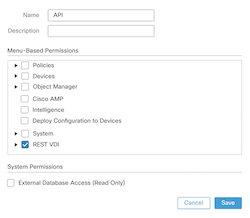
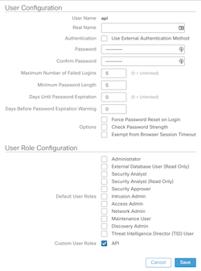

### Sharing Duo User Context (IP & HostProfile) to FMC
  
This repo contains a Python script to grab User context information, IP & Host profile, from a Duo Security authentification and share this with Cisco FMC.

  
Please contact me at alexandre@argeris.net, if you have any questions or remarks. If you find any bugs, please report them to me, and I will correct them. 
  
### VARIABLES TO MODIFY BEFORE RUNNING THE SCRIPT 
parameters.json need to be modify before running the script.

### How to create a FMC user with API role
Add a new role.

Add a new user

### This script is based on the AMP4e-to-FMC-Host-Input-Script available on cisco.com
### Perl script for Host Input (FMC) communications
Note: These files are of 'FMC Host Input API SDK'as-it-is downloaded from CCO without any modifications.
 s f_hos t_input_agent.pl
 SFCheckPreReq.pm
 SFHIclient.pm
 SFHIlog.pm
 SFHos tI nputAgent.pm
 SFPkcs12.pm
 I nputPlugins\csv.pm
